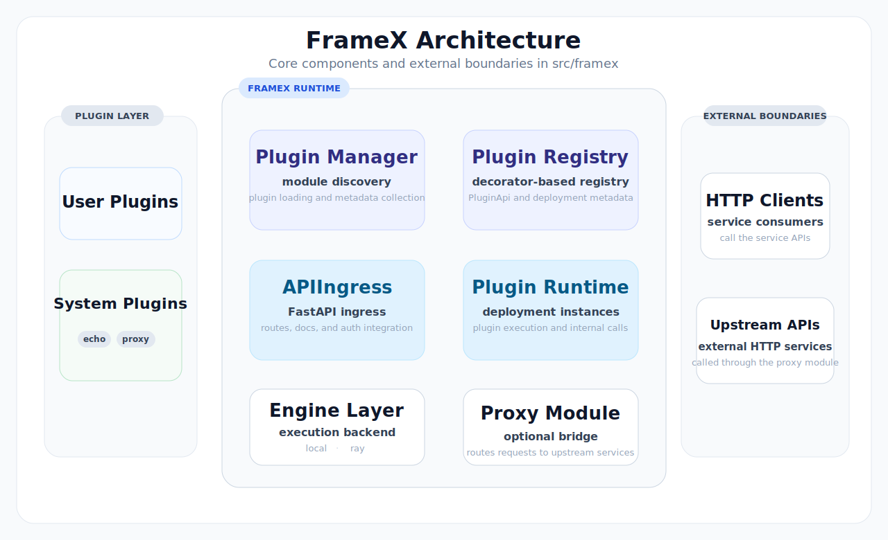

<p align="center">
  
</p>

<h1 align="center">FrameX</h1>

<p align="center">
  🚀 Build scalable Python services with plugins — like FastAPI + Ray, but modular by design.
</p>

<p align="center">
  <strong><a href="https://touale.github.io/FrameX-kit/">Read the Online Documentation</a></strong>
</p>

<p align="center">
  <a href="https://touale.github.io/FrameX-kit/"></a>
  <a href="https://github.com/touale/FrameX-kit/actions/workflows/test.yml"></a>
  <a href="https://app.codecov.io/gh/touale/FrameX-kit"></a>
  <a href="https://github.com/touale/FrameX-kit/releases"></a>
  <a href="https://pypi.org/project/framex-kit/"></a>
  <a href="./LICENSE"></a>
</p>

## About

FrameX is a plugin-first Python framework for teams that need service decomposition, multi-team parallel development, private implementation boundaries, and one consistent service surface across local plugins and upstream APIs.



## What Problem It Solves

FrameX is most useful when multiple teams need to ship capabilities in parallel, call each other through stable service interfaces, and keep implementation details private so each team can work without understanding or depending on other teams' codebases.

Use it when you need to:

- build service capabilities as plug-and-play modules
- let multiple engineers or teams ship in parallel with clearer ownership boundaries
- split a growing service into independently evolving capability units
- call other teams' capabilities without depending on their codebases
- expose local plugins and upstream APIs behind one consistent service surface
- integrate third-party or internal HTTP services with minimal client-side changes
- start with simple local execution and scale to Ray when needed
- keep the system extensible as capabilities, teams, and traffic grow

## Core Concepts

FrameX is built around a few core ideas:

- `Plugin`: a capability package with its own code, metadata, and API surface
- `@on_register()`: registers a plugin class as a runtime unit
- `@on_request(...)`: exposes plugin methods as HTTP APIs, internal callable APIs, or both
- `required_remote_apis`: declares which other plugin or HTTP APIs a plugin depends on
- `call_plugin_api(...)`: lets one capability call another through a stable service interface
- `@remote()`: keeps the same call style across local execution and Ray execution
- `proxy` plugin: makes upstream OpenAPI services look like part of the same service surface

## Why FrameX Instead Of Plain FastAPI

Plain FastAPI is a good choice for a single cohesive application. FrameX is better when the real problem is not route handling, but service decomposition, team boundaries, and cross-service integration.

Compared with plain FastAPI, FrameX gives you:

- plugin boundaries for clearer ownership between capabilities and teams
- a better development model for plug-and-play modules and parallel delivery
- one consistent surface for local capabilities and upstream HTTP services
- internal callable APIs in addition to normal HTTP routes
- explicit dependency declarations between capabilities
- the ability to start locally and move to Ray-backed execution without rewriting plugin code

If you only need a small application with a stable route surface and one codebase, plain FastAPI is usually simpler.

## Features

- plug-and-play development for modular service capabilities
- clearer boundaries for multi-person and multi-team development
- one consistent surface for local plugins and upstream HTTP APIs
- decorator-based registration for HTTP, internal, and streaming APIs
- local execution by default, with an optional path to Ray Serve
- built-in proxying, auth controls, and flexible configuration sources

## Installation

Base package:

```bash
pip install framex-kit
```

With Ray Serve support:

```bash
pip install "framex-kit[ray]"
```

Requirements:

- Python `>=3.11`

## Quick Start

Create `foo.py`:

```python
from typing import Any

from pydantic import BaseModel

from framex.consts import VERSION
from framex.plugin import BasePlugin, PluginMetadata, on_register, on_request

__plugin_meta__ = PluginMetadata(
    name="foo",
    version=VERSION,
    description="A minimal example plugin",
    author="you",
    url="https://github.com/touale/FrameX-kit",
)


class EchoBody(BaseModel):
    text: str


@on_register()
class FooPlugin(BasePlugin):
    def __init__(self, **kwargs: Any) -> None:
        super().__init__(**kwargs)

    @on_request("/foo", methods=["GET"])
    async def echo(self, message: str) -> str:
        return f"foo: {message}"

    @on_request("/foo_model", methods=["POST"])
    async def echo_model(self, model: EchoBody) -> dict[str, str]:
        return {"text": model.text}
```

Run it:

```bash
PYTHONPATH=. framex run --load-plugins foo
```

Call it:

```bash
curl "http://127.0.0.1:8080/api/v1/foo?message=hello"
```

Open docs:

- `http://127.0.0.1:8080/docs`
- `http://127.0.0.1:8080/redoc`
- `http://127.0.0.1:8080/api/v1/openapi.json`

You can also start with the built-in example plugin:

```bash
framex run --load-builtin-plugins echo
```

## CLI

FrameX exposes a `framex` CLI:

```bash
framex run --host 0.0.0.0 --port 8080 --load-builtin-plugins echo
```

Main options:

- `--host`
- `--port`
- `--dashboard-host`
- `--dashboard-port`
- `--num-cpus`
- `--load-plugins`
- `--load-builtin-plugins`
- `--use-ray/--no-use-ray`
- `--enable-proxy/--no-enable-proxy`

Important:

- `--load-plugins` and `--load-builtin-plugins` are repeatable options
- they are not comma-separated lists

Example:

```bash
framex run \
  --load-builtin-plugins echo \
  --load-plugins foo \
  --load-plugins your_project.plugins.bar
```

## Programming Model

### Define plugin metadata

Each plugin module typically defines `__plugin_meta__`:

```python
__plugin_meta__ = PluginMetadata(
    name="demo",
    version=VERSION,
    description="demo plugin",
    author="you",
    url="https://example.com",
    required_remote_apis=["/api/v1/echo", "echo.EchoPlugin.confess"],
)
```

`required_remote_apis` can contain:

- HTTP paths such as `/api/v1/echo`
- internal function APIs such as `echo.EchoPlugin.confess`

### Expose APIs

Use `@on_request(...)` to expose plugin methods.

Typical modes:

- HTTP API: provide a route path
- function API: use `call_type=ApiType.FUNC`
- both: use `call_type=ApiType.ALL`

Current implementation notes:

- a handler may declare at most one `BaseModel` parameter
- `stream=True` produces a streaming endpoint
- `raw_response=True` bypasses the default response wrapper

### Call other plugins

Use `call_plugin_api(...)` to call another registered plugin API:

```python
from framex import call_plugin_api

result = await call_plugin_api("/api/v1/echo", message="hello")
```

FrameX resolves the target API from `required_remote_apis`. If proxy mode is enabled, unresolved HTTP paths can fall back to the built-in proxy plugin. Inside a plugin class, you can also use the convenience wrapper around the same mechanism.

### Use `@remote()`

FrameX provides `@remote()` for functions, instance methods, and class methods.

- in local mode, async functions are awaited directly and sync functions run in a thread pool
- in Ray mode, calls are wrapped with `ray.remote(...)`

```python
from framex.plugin import remote


@remote()
def heavy_job(x: int) -> int:
    return x * 2


result = await heavy_job.remote(21)
```

## Configuration

FrameX settings are loaded from:

- environment variables
- `.env`
- `.env.prod`
- `config.toml`
- `[tool.framex]` in `pyproject.toml`

CLI options override the in-memory settings before startup.

Minimal `config.toml`:

```toml
load_builtin_plugins = ["echo"]
load_plugins = ["your_project.plugins.foo"]

[server]
host = "127.0.0.1"
port = 8080
use_ray = false
enable_proxy = false

[plugins.foo]
debug = true
```

Common settings:

- `server.host`, `server.port`
- `server.use_ray`
- `server.enable_proxy`
- `load_builtin_plugins`
- `load_plugins`
- `plugins.<plugin_name>`
- `auth.rules`

Nested environment variables are supported, for example:

```bash
export SERVER__PORT=9000
export SERVER__ENABLE_PROXY=true
```

## Proxy Mode

FrameX includes a built-in `proxy` plugin for bridging external HTTP services.

To enable it:

1. load the built-in `proxy` plugin
1. set `server.enable_proxy = true`
1. configure upstream service URLs in `plugins.proxy`

Example:

```toml
load_builtin_plugins = ["proxy"]

[server]
enable_proxy = true

[plugins.proxy]
proxy_urls = ["http://127.0.0.1:9000"]
force_stream_apis = ["/api/v1/chat/stream"]
white_list = ["/*"]
timeout = 600
```

The current implementation reads the upstream `/api/v1/openapi.json` document and dynamically creates local forwarding routes. It supports:

- query parameters
- JSON request bodies
- `multipart/form-data`
- file upload fields
- forced streaming APIs

## Built-in Plugins

### `echo`

The built-in example plugin exposes:

- `GET /api/v1/echo`
- `POST /api/v1/echo_model`
- `GET /api/v1/echo_stream`
- function API `echo.EchoPlugin.confess`

### `proxy`

The built-in system proxy plugin is used to:

- register proxy routes from remote OpenAPI specs
- forward unresolved HTTP APIs
- register and call proxy functions

## Runtime Behavior

A few implementation details are important for adopters:

- docs are served at `/docs` and `/redoc`
- OpenAPI is served at `/api/v1/openapi.json`
- health endpoints include `/health` and `/ping`
- non-streaming API responses are wrapped into a common JSON envelope unless `raw_response=True` is used
- if `auth.oauth` is configured, docs and OpenAPI access are protected through the auth flow

Default wrapped response shape:

```json
{
  "status": 200,
  "message": "success",
  "timestamp": "2026-01-01 12:00:00",
  "data": {}
}
```

## Architecture

The `src/framex` package is organized into a small set of layers:

- `cli.py`: command-line entrypoint
- `config.py`: settings models and source precedence
- `plugin/`: decorators, plugin loading, registration, dependency resolution
- `adapter/`: local and Ray runtime adapters
- `driver/`: FastAPI application, auth, ingress, middleware
- `plugins/`: built-in plugins such as `echo` and `proxy`

## Use Cases

FrameX fits well when you want to:

- split a service into independently maintained capability modules
- keep a FastAPI-friendly programming model while adding a plugin boundary
- reuse the same plugin code in local and Ray-based deployments
- gradually bridge legacy HTTP services into a unified API surface

## Project Status

FrameX is usable today, but the project should be treated as an actively evolving framework rather than a frozen platform API.

If you plan to adopt it in production, review the current implementation details and test the behaviors you depend on, especially around proxying, response wrapping, and auth integration.

## Contributing

Contributions are welcome.

A good contribution path is:

1. open an issue for bugs, API gaps, or design discussion
1. keep pull requests focused and small
1. include tests for behavior changes when possible
1. update documentation when the public behavior changes

## License

This project is licensed under `MIT`. See [LICENSE](./LICENSE).
